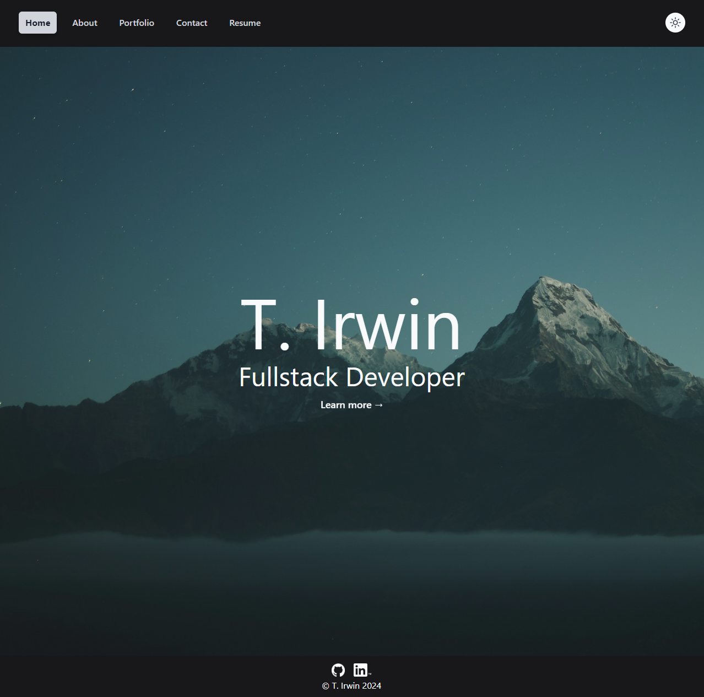
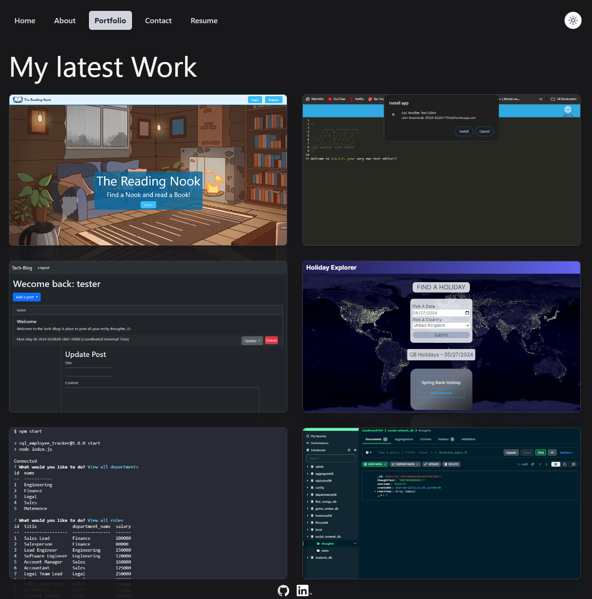

# T. Irwin Portfolio (React)

## Description

This is my react portfolio that I desined. It is a single page website ustilizing react components. The website is fully front end and styled with TailwindCSS and SCSS. I will be using this as my main portfolio for some time and it will evolve along with me.

## Table of Contents

- [Usage](#usage)
- [Credits](#credits)
- [License](#license)
- [How to Contribute](#how-to-contribute)
- [Tests](#tests)
- [Questions](#questions)

## Visuals

## Usage

Once the page loads you will see a landing page. You can navigate thrue the site by using the nav bar or you can click on the bouncing learn more button. This will redirect you to the about page. The portfolio page features my six latest projects and will be updated as I complete more. Navigating to the contact page you can send me a message. Lastly, the resume page has a download button where you can download my resume.

## Credits

- JD Tadlock: For all the instruction in the Rutgers Coding Bootcamp
- Alphardex: https://codepen.io/alphardex/pen/ExaZgxp
- Naoya: https://codepen.io/nxworld/pen/OVMzaP

## Deployment

[My Portfolio](https://t-irwin.netlify.app/)

## License

#### MIT

A short and simple permissive license with conditions only requiring preservation of copyright and license notices. Licensed works, modifications, and larger works may be distributed under different terms and without source code.
[Link to License](https://opensource.org/license/MIT)
You can also check out the LICENSE in the repo.

## How to Contribute

Check out the [Contributor Covenant](https://www.contributor-covenant.org/version/2/1/code_of_conduct/code_of_conduct.md)

## Tests

N/A

## Questions

If you have any questions check out my [Github](https://github.com/TIrwin19).
